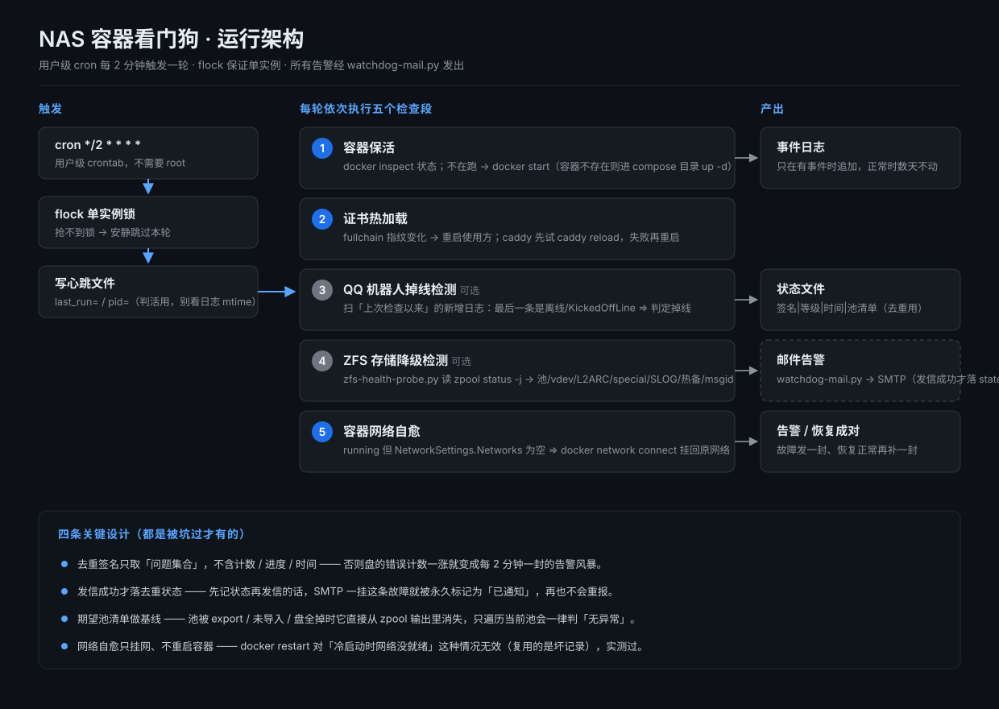
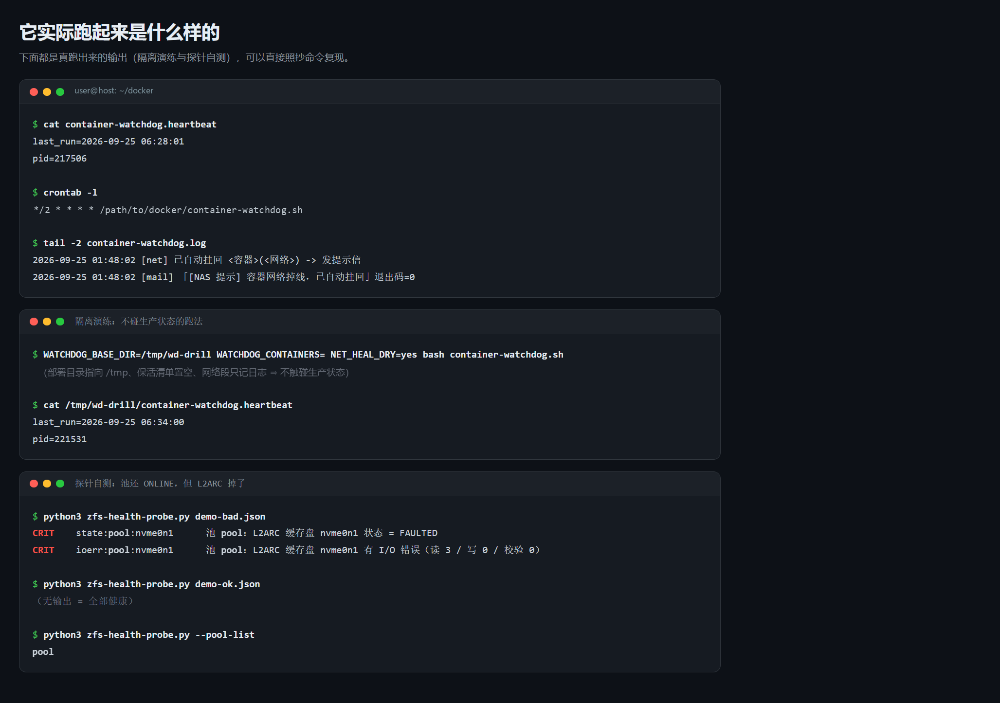

# container-watchdog.sh

> 本工具由 DeepSeek（DSH agent）编写，由 CNyaotian 维护与发布。
>
> **English:** Written by DeepSeek (the DSH agent), maintained and published by CNyaotian.

面向家庭 NAS 的**容器看门狗**：定时保活容器、证书续期后热加载、故障邮件告警、容器网络自愈。
单文件主脚本、纯 bash、不依赖 systemd，用**用户级 cron 每 2 分钟**执行一次，不需要 root。

**English:** A **container watchdog** for a home NAS: it keeps containers alive on a schedule, hot-reloads certificates after renewal, sends failure-alert emails, and heals container networking by itself.
A single-file main script, pure bash, no systemd dependency, run by a **user-level cron every 2 minutes** — no root required.

写它的起因：Docker 的 `live-restore` 与 `unless-stopped` 组合存在"手动停过就永不自启"的行为，
再加上 NAS 冷启动时宿主网络尚未就绪会导致容器**静默失联**（下文详述），
这些情况都不会有任何提示。本脚本负责兜底并在第一时间发邮件告警。

**English:** Why it was written: the combination of Docker's `live-restore` and `unless-stopped` has a "once stopped by hand, it never starts again" behaviour, and on top of that a NAS cold boot can leave host networking not yet ready, which makes containers **silently lose connectivity** (detailed below) — and none of these situations gives any warning. This script is the backstop and sends an alert email at the first sign of trouble.





> 图中标题栏的主机名与命令行里的路径已替换为占位符。
> **English:** The hostname in the title bar and the paths in the commands have been replaced with placeholders.

---

## 〇、仓库内容（三件套）/ 0. What's in the Repo (the trio)

| 文件 | 作用 |
|---|---|
| `container-watchdog.sh` | 主脚本：容器保活 / 证书热加载 / 告警编排 / 容器网络自愈 |
| `zfs-health-probe.py` | ZFS 存储健康探针：读 `zpool status -j`，每行输出 `<级别>\t<签名键>\t<消息>` |
| `watchdog-mail.py` | 告警邮件发送器（纯标准库，支持 `SMTP_SSL:465` 与 `STARTTLS:587`） |

**English:**

| File | Purpose |
|---|---|
| `container-watchdog.sh` | main script: container keep-alive / certificate hot-reload / alert orchestration / container network self-healing |
| `zfs-health-probe.py` | ZFS storage health probe: reads `zpool status -j` and prints `<level>\t<signature key>\t<message>` per line |
| `watchdog-mail.py` | alert mail sender (pure standard library, supports `SMTP_SSL:465` and `STARTTLS:587`) |

三个文件放在同一个目录即可，彼此通过相对约定（同目录）与几个环境变量衔接，不需要安装。

**English:** Just put the three files in the same directory; they link up through a relative convention (same directory) and a few environment variables. Nothing to install.

---

## 一、功能（可各自开关）/ 1. Features (each can be switched on or off)

| 段 | 做什么 | 默认 |
|---|---|---|
| 容器保活 | 清单里的容器不是 `running` 就拉起来；容器不存在则进它的 compose 目录 `docker compose up -d` | 开 |
| 证书热加载 | acme 证书文件变化后，重启用到它的容器；caddy 优先 `caddy reload`，失败再重启 | 需配置路径 |
| 邮件告警 | 掉线、存储异常、网络掉线等事件发信；恢复时补发「已恢复」 | 需配置凭据 |
| QQ 机器人掉线检测 | 扫描容器日志判断账号是否被踢下线（NapCat 判据），离线/恢复各发一封 | 关（可选） |
| ZFS 存储降级检测 | 检查池 / vdev / **L2ARC cache** / special / SLOG / 热备的 state 与 I/O 错误 | 关（可选） |
| 容器网络自愈 | 发现「running 但没有任何网络」的容器，挂回它自己的网络 | 开 |

**English:**

| Section | What it does | Default |
|---|---|---|
| Container keep-alive | starts any container in the list that is not `running`; if the container does not exist, it goes into its compose directory and runs `docker compose up -d` | on |
| Certificate hot-reload | after an acme certificate file changes, restarts the containers that use it; for caddy it prefers `caddy reload` and only restarts if that fails | needs a configured path |
| Mail alerts | emails on events such as going offline, storage anomalies, network loss; on recovery it sends a follow-up "recovered" mail | needs configured credentials |
| QQ bot offline detection | scans container logs to decide whether the account was kicked offline (the NapCat criterion); one mail for offline, one for recovery | off (optional) |
| ZFS storage degradation detection | checks the state and I/O errors of pools / vdevs / **L2ARC cache** / special / SLOG / hot spares | off (optional) |
| Container network self-healing | finds containers that are "running but have no network at all" and re-attaches them to their own network | on |

关于**容器网络自愈**为什么单独做一段：NAS 冷启动时如果宿主网络还没就绪（路由器与光猫尚未起来、
DHCP 还没拿到地址），dockerd 会给容器登记网络端点却没有真正建出 veth，容器 netns 里只剩 `lo`，
任何出网都是 `Network is unreachable`。`docker restart` 对这种情况**无效**（复用的是那条坏记录），
只有新增端点的 `docker network connect` 才能真正重建网卡。本段只挂网、不重启容器。

**English:** On why **container network self-healing** is a separate section: if host networking is not ready during a NAS cold boot (the router and ONT are not up yet, DHCP has not handed out an address), dockerd registers a network endpoint for the container but never actually creates the veth — the container's netns is left with only `lo`, and any outbound traffic is `Network is unreachable`. `docker restart` is **useless** here (it reuses that broken record); only `docker network connect`, which adds a new endpoint, can really rebuild the NIC. This section only attaches the network, it does not restart containers.

关于**ZFS 存储降级检测**为什么单独做一段：`zpool status` 显示的池整体状态是 `ONLINE` 时，
L2ARC（cache）与 special 段仍可能掉线 —— 这两类设备不在池的 vdevs 树里，是顶层独立字段，
只看池 health 的巡检对它们完全静默。探针 `zfs-health-probe.py` 专门覆盖这些字段。

**English:** On why **ZFS storage degradation detection** is a separate section: even when the pool's overall state as shown by `zpool status` is `ONLINE`, the L2ARC (cache) and special sections can still be offline — these two kinds of device are not in the pool's vdevs tree but are top-level standalone fields, so an inspection that only looks at pool health is completely silent about them. The `zfs-health-probe.py` probe covers these fields specifically.

---

## 二、依赖 / 2. Dependencies

- `bash` 4 以上
  **English:** `bash` 4 or newer
- `docker`（含 `docker compose`）
  **English:** `docker` (including `docker compose`)
- `flock`（util-linux，用于单实例锁）
  **English:** `flock` (util-linux, used for the single-instance lock)
- `python3`（仅「邮件告警」与「存储检测」两段需要）
  **English:** `python3` (only needed by the "mail alerts" and "storage detection" sections)
- 发信脚本 `watchdog-mail.py`（本仓库自带）：接口为 `python3 watchdog-mail.py "<主题>" -`
  （正文从标准输入读取）；退出码 0 = 发送成功 / 1 = 凭据问题 / 2 = 参数或配置问题（如参数个数不对、加密端口 `SMTP_PORT` 不是数字）/ 3 = 发送失败。
  收件人与 SMTP 凭据放在 `watchdog-mail.env`：看门狗主脚本只按 `${BASE_DIR}/watchdog-mail.env`
  判断凭据在不在，**真正读取凭据的是发信脚本** —— 它优先用环境变量 `WATCHDOG_MAIL_ENV` 指定的
  路径，未设置时取**发信脚本自己所在目录**下的 `watchdog-mail.env`。⇒ 若 `BASE_DIR` 与发信脚本
  目录不是同一个，两边看的就不是同一个文件，请显式设置 `WATCHDOG_MAIL_ENV` 让二者一致。
  **该文件权限必须 600。**
  **English:** mailer script `watchdog-mail.py` (bundled in this repo): its interface is `python3 watchdog-mail.py "<subject>" -` (the body is read from stdin); exit code 0 = sent successfully / 1 = credential problem / 2 = argument or configuration problem (e.g. wrong number of arguments, non-numeric `SMTP_PORT`) / 3 = send failed. The recipient and SMTP credentials live in `watchdog-mail.env`: the main script only checks whether `${BASE_DIR}/watchdog-mail.env` exists, while the file is actually read by `watchdog-mail.py`, which prefers the path given by the `WATCHDOG_MAIL_ENV` environment variable and otherwise falls back to `watchdog-mail.env` **next to the mailer script itself**. So if `BASE_DIR` differs from the mailer's directory those two checks look at different files — set `WATCHDOG_MAIL_ENV` explicitly to keep them in sync. The file's **permissions must be 600**.
- ZFS 探针 `zfs-health-probe.py`（本仓库自带）：需要能读 `zpool status -j`，
  若普通用户没有权限，加一条 `sudoers` 免密规则（仅授权 `zpool status`）即可。
  **English:** ZFS probe `zfs-health-probe.py` (bundled in this repo): it needs to be able to read `zpool status -j`; if an ordinary user lacks permission, add a passwordless `sudoers` rule (authorising `zpool status` only) and it works.

---

## 三、安装 / 3. Installation

1. 把三个文件放到同一个目录（以下示例为 `/path/to/docker`，换成你自己的部署目录）并赋予执行权限：
   **English:** Put the three files in the same directory (`/path/to/docker` in the examples below — replace it with your own deployment directory) and give them execute permission:

   ```bash
   cd /path/to/docker
   chmod +x container-watchdog.sh zfs-health-probe.py watchdog-mail.py
   ```

2. 建邮件凭据文件 `watchdog-mail.env`，并设权限 600：
   **English:** Create the mail credentials file `watchdog-mail.env` and set its permissions to 600:

   ```ini
   SMTP_HOST=smtp.163.com
   SMTP_PORT=465
   SMTP_USER=你的邮箱@163.com
   SMTP_PASS=客户端授权码
   MAIL_FROM=你的邮箱@163.com
   MAIL_TO=收件邮箱@example.com
   ```

   ```bash
   chmod 600 watchdog-mail.env
   ```

3. 编辑 `container-watchdog.sh` 顶部的「配置区」，至少设置 `WATCH_CONTAINERS`（保活清单）。
   `BASE_DIR`（部署目录）**默认就是脚本所在目录**，把三件套放在同一目录时无需改动；
   要日志 / 状态文件落到别处（或做隔离演练）再用 `WATCHDOG_BASE_DIR` 指定。
   **English:** Edit the "config section" at the top of `container-watchdog.sh`; at minimum set `WATCH_CONTAINERS` (the keep-alive list). `BASE_DIR` (the deployment directory) **defaults to the directory the script itself lives in**, so with all three files in one directory there is nothing to change; use `WATCHDOG_BASE_DIR` when you want the logs / state files elsewhere (or for an isolated drill).

4. 演练一遍。⚠️ **这一步不是零副作用**：`MAIL_DRY` / `NET_HEAL_DRY` 只抑制**发信**与**挂网**，
   **保活段仍会真的拉起容器、证书段仍会真的重启容器**，日志 / 心跳 / 状态文件也写进真实的 `BASE_DIR`。
   想完全不触碰容器与网络，请用第五节的隔离演练（保活清单置空 + 独立 `BASE_DIR`）。
   **English:** Do one drill run. ⚠️ **This step is not side-effect free**: `MAIL_DRY` / `NET_HEAL_DRY` only suppress **mailing** and **attaching networks** — the keep-alive section still really starts containers and the certificate section still really restarts them, and the log / heartbeat / state files are written into the real `BASE_DIR`. To touch no container and no network at all, use the isolated drill in section 5 (empty keep-alive list plus a separate `BASE_DIR`).

   ```bash
   MAIL_DRY=yes NET_HEAL_DRY=yes bash ./container-watchdog.sh
   ```

   然后确认心跳文件已写好：
   **English:** Then confirm the heartbeat file has been written:

   ```bash
   cat /path/to/docker/container-watchdog.heartbeat
   ```

5. 加入**用户级** crontab（不需要 root）：
   **English:** Add it to the **user-level** crontab (no root needed):

   ```
   */2 * * * * /path/to/docker/container-watchdog.sh
   ```

6. 验证 cron 真的在跑（心跳每 2 分钟更新一次）：
   **English:** Verify cron is really running (the heartbeat updates every 2 minutes):

   ```bash
   date; cat /path/to/docker/container-watchdog.heartbeat
   ```

### 单测探针（用假数据，完全不碰真机）/ Unit-Testing the Probe (with fake data, never touching the real machine)

`zfs-health-probe.py` 支持直接喂一份 `zpool status -j` 的 JSON：
**English:** `zfs-health-probe.py` accepts a `zpool status -j` JSON fed straight to it:

```bash
python3 zfs-health-probe.py /path/to/status.json           # 有异常才有输出，无输出 = 健康
python3 zfs-health-probe.py --selfcheck                    # 打印被检查对象的基线清单（人眼核对）
python3 zfs-health-probe.py --pool-list                    # 只打印当前池名
python3 zfs-health-probe.py --selfcheck /path/to/status.json   # 完全离线（喂假数据）
```

上面**不带文件路径**的 `--selfcheck` / `--pool-list` 会去读本机真实的 `zpool status -j`（只读）；
要完全离线就把 JSON 路径一起传进去（最后一条示例）。

**ZFS 字段会随版本变化**：大版本升级后请跑一次 `--selfcheck` 抽验字段还在不在
（字段消失 = 永远健康的静默失效）。

**English:** **ZFS fields change between versions**: after a major upgrade, run `--selfcheck` once to spot-check that the fields are still there (a vanished field = a silent failure that always reports healthy).

Without a JSON file, `--selfcheck` / `--pool-list` read the real local `zpool status -j` (read-only); pass a JSON path as in the last example above to stay completely offline.

---

## 四、配置项 / 4. Configuration Options

全部位于 `container-watchdog.sh` 顶部「配置区」，均可用同名环境变量覆盖（便于演练与外部管理）。

**English:** All of them live in the "config section" at the top of `container-watchdog.sh`, and every one can be overridden by an environment variable of the same name (handy for drills and for external management).

| 配置 | 环境变量 | 说明 |
|---|---|---|
| `BASE_DIR` | `WATCHDOG_BASE_DIR` | 部署目录，日志 / 心跳 / 锁 / 状态文件都放这里 |
| `HOST_LABEL` | `WATCHDOG_HOST_LABEL` | 邮件正文里显示的机器地址（内网 IP 或域名），留空则只显示主机名 |
| `PANEL_HINT` | `WATCHDOG_PANEL_HINT` | 邮件正文附带的排查入口，可留空 |
| `WATCH_CONTAINERS` | `WATCHDOG_CONTAINERS` | 保活清单，格式 `容器名:compose目录`；用环境变量覆盖时以逗号分隔，设为空串表示一个都不保活 |
| `CERT` | `WATCHDOG_CERT` | 证书 `fullchain.cer` 的绝对路径，留空关闭证书热加载 |
| `CERT_TARGETS` | `WATCHDOG_CERT_TARGETS` | 证书更新后要重启的容器，空格分隔 |
| `CADDY_CONTAINER` | `WATCHDOG_CADDY_CONTAINER` | 优先执行 `caddy reload` 的容器名 |
| `MAILER` / `MAIL_ENV` | 无（都由 `BASE_DIR` 派生） | 发信脚本与凭据文件路径：`${BASE_DIR}/watchdog-mail.py`、`${BASE_DIR}/watchdog-mail.env`（后者只用于「存不存在」判断，真正读凭据的是发信脚本，见上面的依赖说明） |
| `NAPCAT_CONTAINER` | `WATCHDOG_NAPCAT_CONTAINER` | 填容器名才启用「QQ 机器人掉线检测」段 |
| `STORAGE_ENABLED` | `STORAGE_ENABLED` | 设为 `yes` 才启用 ZFS 存储段（需要配套探针） |
| `STORAGE_PROBE` | `WATCHDOG_STORAGE_PROBE` | 探针脚本路径，默认取部署目录下的 `zfs-health-probe.py` |
| `NET_HEAL_ENABLED` | `NET_HEAL_ENABLED` | 容器网络自愈段开关，默认 `yes` |

**English:**

| Setting | Environment variable | Description |
|---|---|---|
| `BASE_DIR` | `WATCHDOG_BASE_DIR` | deployment directory; logs / heartbeat / lock / state files all go here |
| `HOST_LABEL` | `WATCHDOG_HOST_LABEL` | the machine address shown in the mail body (LAN IP or domain name); leave empty to show only the hostname |
| `PANEL_HINT` | `WATCHDOG_PANEL_HINT` | a troubleshooting entry point included in the mail body; may be left empty |
| `WATCH_CONTAINERS` | `WATCHDOG_CONTAINERS` | the keep-alive list, format `container-name:compose-dir`; when overridden by the environment variable it is comma-separated, and an empty string means nothing is kept alive |
| `CERT` | `WATCHDOG_CERT` | absolute path of the certificate `fullchain.cer`; empty disables certificate hot-reload |
| `CERT_TARGETS` | `WATCHDOG_CERT_TARGETS` | containers to restart after the certificate is renewed, space-separated |
| `CADDY_CONTAINER` | `WATCHDOG_CADDY_CONTAINER` | name of the container that should get `caddy reload` first |
| `MAILER` / `MAIL_ENV` | none (both derived from `BASE_DIR`) | paths of the mailer script and the credentials file: `${BASE_DIR}/watchdog-mail.py` and `${BASE_DIR}/watchdog-mail.env` (the latter is only checked for existence — the actual read is done by the mailer, see the dependency note above) |
| `NAPCAT_CONTAINER` | `WATCHDOG_NAPCAT_CONTAINER` | the "QQ bot offline detection" section is only enabled when a container name is set |
| `STORAGE_ENABLED` | `STORAGE_ENABLED` | the ZFS storage section is only enabled when set to `yes` (requires the matching probe) |
| `STORAGE_PROBE` | `WATCHDOG_STORAGE_PROBE` | probe script path; defaults to `zfs-health-probe.py` in the deployment directory |
| `NET_HEAL_ENABLED` | `NET_HEAL_ENABLED` | switch for the container network self-healing section; defaults to `yes` |

---

## 五、演练开关（默认全部不生效，行为与常规一致）/ 5. Drill Switches (all inert by default; behaviour otherwise unchanged)

| 变量 | 作用 |
|---|---|
| `MAIL_DRY=yes` | 只记日志，不真的发信 |
| `NET_HEAL_DRY=yes` | 只记日志，不真的挂网络 |
| `STORAGE_PROBE_SRC=<文件>` | 用一份假的 `zpool status -j` 输出驱动存储段，不调用真实探针 |
| `NAPCAT_LOG_SRC=<文件>` | 用一份假的容器日志驱动掉线检测 |

**English:**

| Variable | Effect |
|---|---|
| `MAIL_DRY=yes` | only log, do not actually send mail |
| `NET_HEAL_DRY=yes` | only log, do not actually attach the network |
| `STORAGE_PROBE_SRC=<file>` | drive the storage section with a fake `zpool status -j` output instead of calling the real probe |
| `NAPCAT_LOG_SRC=<file>` | drive offline detection with a fake container log |

示例：隔离演练一轮 —— **不碰任何容器、不发信、不挂网**（保活清单显式置空、网络段 dry-run）。
注意它**不是零副作用**：日志 / 心跳 / 锁 / 状态文件都会写进 `WATCHDOG_BASE_DIR` 指向的隔离目录
（示例为 `/tmp/wd-drill`，**目录要自己先建**），过程中还会**只读地**调用 `docker ps` / `docker inspect`。

**English:** Example: one isolated drill run — **no container is touched, no mail is sent, no network is attached** (the keep-alive list is explicitly empty and the network section runs in dry-run mode). Note that it is **not side-effect free**: the log / heartbeat / lock / state files all land in the isolated directory that `WATCHDOG_BASE_DIR` points at (`/tmp/wd-drill` in the example — **create it first**), and the run still calls `docker ps` / `docker inspect` in a **read-only** way.

```bash
mkdir -p /tmp/wd-drill
WATCHDOG_BASE_DIR=/tmp/wd-drill WATCHDOG_CONTAINERS= \
WATCHDOG_STORAGE_PROBE="$PWD/zfs-health-probe.py" \
MAIL_DRY=yes NET_HEAL_DRY=yes STORAGE_ENABLED=yes STORAGE_PROBE_SRC=/tmp/fake-status.json \
bash ./container-watchdog.sh
```

（存储段只在 `STORAGE_ENABLED=yes` 时才跑；`WATCHDOG_STORAGE_PROBE` 把探针指到真实文件 ——
隔离目录里没有它 —— 这时 `STORAGE_PROBE_SRC` 才会被用来喂那份假的 `zpool status -j`；
这两个少给一个，结果都会变成「探针缺失」告警。）
**English:** (The storage section only runs with `STORAGE_ENABLED=yes`; `WATCHDOG_STORAGE_PROBE` points at the real
probe — the isolated directory does not contain it — and only then does `STORAGE_PROBE_SRC` feed the fake
`zpool status -j`; leave either of them out and you get a "probe missing" alert instead.)

---

## 六、生成的文件 / 6. Generated Files

| 文件 | 用途 |
|---|---|
| `container-watchdog.heartbeat` | 每轮重写 `last_run=` 与 `pid=`，**用它判断看门狗是否活着** |
| `container-watchdog.log` | 事件日志，仅在有事发生时追加 |
| `container-watchdog.lock` | 单实例锁 |
| `cert-renew.stamp` | 上一次证书指纹，用于判断是否续期 |
| `napcat-alert.state` | 掉线检测去重状态 |
| `storage-alert.state` | 存储告警去重状态，格式 `签名\|等级\|时间\|池清单` |
| `network-alert.state` | 网络自愈去重状态 |

**English:**

| File | Purpose |
|---|---|
| `container-watchdog.heartbeat` | rewrites `last_run=` and `pid=` every round; **use it to tell whether the watchdog is alive** |
| `container-watchdog.log` | event log, appended only when something happens |
| `container-watchdog.lock` | single-instance lock |
| `cert-renew.stamp` | the previous certificate fingerprint, used to decide whether it was renewed |
| `napcat-alert.state` | deduplication state for offline detection |
| `storage-alert.state` | deduplication state for storage alerts, format `signature\|level\|time\|pool list` |
| `network-alert.state` | deduplication state for network self-healing |

注意：**日志只在有事件时追加**，正常运行时可能数天不更新，这不代表脚本死了；
判断存活请看心跳文件的更新时间。

**English:** Note: **the log is appended only when there is an event**, so during normal operation it may go days without updating — that does not mean the script is dead; to judge whether it is alive, look at the heartbeat file's timestamp.

---

## 七、设计要点（都是踩过坑才有的，改动前请先读懂）/ 7. Design Notes (every one of these came from a real pitfall — understand them before changing anything)

1. **发信成功才落去重状态。** 若先记状态再发信，SMTP 一旦故障，这条故障就会被永久标记为「已通知」，
   再也不会重报，恢复信同样发不出去。发送失败必须保留旧状态、下一轮重试。
   **English:** **Write the deduplication state only after the mail was sent successfully.** If you record the state before sending, then the moment SMTP has a fault this fault gets permanently marked "already notified", it never gets reported again, and the recovery mail cannot go out either. A failed send must keep the old state and retry next round.
2. **去重签名只取「问题集合」，绝不含计数、进度、时间。** 盘的错误计数从 12 涨到 99、
   scrub 正在跑，这些都会让签名每轮变化，从而变成每 2 分钟一封的告警风暴。
   **English:** **The deduplication signature takes only the "set of problems" and never counts, progress or timestamps.** A disk error count rising from 12 to 99, or a scrub running, would change the signature every round and turn into an alert storm of one mail every 2 minutes.
3. **池「消失」必须单独报。** `zpool status` 只报它看得见的池；一个池被 export、未导入或盘全掉时，
   它会直接从输出里消失，所有「遍历池」的判据都变成「无异常」。因此额外维护期望池清单基线。
   **English:** **A pool "disappearing" must be reported separately.** `zpool status` only reports the pools it can see; when a pool is exported, not imported, or has lost all its disks, it simply vanishes from the output, and every "iterate over the pools" criterion turns into "no anomaly". So an expected-pool-list baseline is maintained on the side.
4. **L2ARC 掉线时池整体仍可能是 `ONLINE`。** cache / special 段不在 vdevs 树里，
   只看池 health 的巡检对它完全静默，所以存储段必须单独看这些顶层键。
   **English:** **When L2ARC is offline the pool as a whole can still be `ONLINE`.** The cache / special sections are not in the vdevs tree, so an inspection that only looks at pool health is entirely silent about them; the storage section must therefore look at these top-level keys separately.
5. **热备盘 `AVAIL`（插着未启用）算健康**，只有 `INUSE` / `DEGRADED` / `FAULTED` 等才算故障。
   **English:** **A hot spare in `AVAIL` (plugged in but not in use) counts as healthy**; only `INUSE` / `DEGRADED` / `FAULTED` etc. count as a fault.
6. **scrub / resilver 进行中不告警。** scan 的真实状态串是
   `NONE` / `SCANNING` / `FINISHED` / `CANCELED` / `ERRORSCRUBBING`，进度数字每轮都在变。
   **English:** **Do not alert while a scrub / resilver is in progress.** The real state strings of a scan are `NONE` / `SCANNING` / `FINISHED` / `CANCELED` / `ERRORSCRUBBING`, and the progress numbers change every round.
7. **cron 每 2 分钟一轮，一轮超时会重叠**，用 `flock` 让重叠的那轮安静跳过。
   **English:** **Cron runs a round every 2 minutes, so an overrunning round overlaps with the next**, and `flock` makes the overlapping round skip quietly.
8. **判活看心跳文件，不要看日志 mtime。**
   **English:** **Judge liveness from the heartbeat file, not from the log's mtime.**

---

## 八、已知行为与限制 / 8. Known Behaviour and Limitations

- 存储段开启但探针文件不存在时，日志里会多出一行 `python3: can't open file ...` 的报错
  （来自 `--pool-list` 调用）；这是预期噪音，同一轮仍会正确发出「探针缺失」告警。
  **English:** When the storage section is enabled but the probe file does not exist, an extra `python3: can't open file ...` error appears in the log (coming from the `--pool-list` call); this is expected noise, and the same round still correctly raises the "probe missing" alert.
- 本脚本只做「保活 / 挂网 / 告警」，**不会**重建 Docker 网络、不会重启 dockerd。
  **English:** This script only does "keep-alive / attach network / alert"; it does **not** rebuild Docker networks and does not restart dockerd.
- 保活清单里的容器若被手动停掉，会被下一轮自动拉起；不想被拉起就从清单里删掉。
  **English:** If a container on the keep-alive list is stopped manually, the next round starts it again; if you do not want that, remove it from the list.
- 邮件正文里的地址来自 `HOST_LABEL` / `PANEL_HINT`，留空则邮件只带主机名。
  **English:** The addresses in the mail body come from `HOST_LABEL` / `PANEL_HINT`; if they are left empty the mail carries only the hostname.

---

## 运行环境 / Requirements

- **Linux + bash**（本仓脚本面向 NAS/服务器；本机以 **Git Bash** 做过语法检查与隔离干跑）。
- **Python 3**（探针 `zfs-health-probe.py` 与邮件 `watchdog-mail.py`；本机在 **Python 3.12** 上实测通过）。
- **外部命令**：`docker`、`zpool`/`zfs`（探针与保活段用）；若启用邮件，还需要一个可用的 SMTP 或本机 `sendmail`。
- **权限**：巡检本身只读；**「挂回容器」「探针修复」这类动作需要能操作 Docker 的权限**（通常 root）。
- **运行依赖：无**（只用 Python 标准库与系统命令）。

**English:**
- **Linux + bash** (these scripts target a NAS/server; syntax-checked and dry-run in isolation with **Git Bash** here).
- **Python 3** (the probe `zfs-health-probe.py` and the mailer `watchdog-mail.py`; verified on **Python 3.12** here).
- **External commands**: `docker`, `zpool`/`zfs` (used by the probe and the keep-alive section); if mail is enabled, a working SMTP server or a local `sendmail`.
- **Privileges**: inspection is read-only; **actions such as re-attaching a container or fixing a probe need the rights to drive Docker** (usually root).
- **Runtime dependencies: none** (Python standard library plus system commands only).

## 权限与依赖 / Permissions & Dependencies

> 本节保守描述本程序对系统的接触面；「未发现」不等于「不访问」，一切以源码为准。

**文件 / Files**

- 读：脚本自身与同目录的 `zfs-health-probe.py` / `watchdog-mail.py`；凭据文件；`CERT` 指向的证书文件（默认空）；
  `BASE_DIR` 下几个状态文件的存在性检查。
- 写：**只在 `BASE_DIR` 内**（默认 = 脚本所在目录）写 `container-watchdog.log`、`container-watchdog.heartbeat`、
  `container-watchdog.lock`、`cert-renew.stamp`、`napcat-alert.state`、`storage-alert.state`、
  `network-alert.state`，以及日志裁剪用的临时文件 `container-watchdog.log.tmp`。
- 容器保活时会**切换工作目录**进 `WATCH_CONTAINERS` 里写的 compose 目录执行 `docker compose up -d`。

**English:** Read: the scripts themselves and `zfs-health-probe.py` / `watchdog-mail.py` next to them; the
credentials file; the certificate file given by `CERT` (empty by default); and an existence check of a few state
files under `BASE_DIR`. Write: **only inside `BASE_DIR`** (default = the script's own directory) —
`container-watchdog.log`, `container-watchdog.heartbeat`, `container-watchdog.lock`, `cert-renew.stamp`,
`napcat-alert.state`, `storage-alert.state`, `network-alert.state`, plus the log-rotation temporary file
`container-watchdog.log.tmp`. Keep-alive also **changes the working directory** into the compose directory given in
`WATCH_CONTAINERS` to run `docker compose up -d`.

**网络 / Network**

- 主脚本自身不发起任何网络连接（它只驱动本机的 `docker` 与 `python3`）。
- 唯一会出网的是 `watchdog-mail.py`：连接 `SMTP_HOST`（默认 `smtp.163.com`；端口 465 走 SSL，其他端口走
  STARTTLS）。**可以完全关掉**：不创建凭据文件，或加 `MAIL_DRY=yes`。

**English:** The main script opens no network connections itself (it only drives the local `docker` and `python3`).
The only component that goes online is `watchdog-mail.py`, which connects to `SMTP_HOST` (default `smtp.163.com`;
port 465 uses SSL, any other port uses STARTTLS). It **can be disabled entirely**: do not create the credentials
file, or run with `MAIL_DRY=yes`.

**命令 / Commands**

- 会调用：`docker inspect`、`docker ps`、`docker start`、`docker restart`、`docker exec <caddy> caddy reload`、
  `docker network connect`、`docker compose up -d`，以及 `python3`（发信与存储段）、`flock`、`hostname`、`date`、
  `stat`、`md5sum`、`sed`、`grep`、`tail`、`cut`、`tr`、`wc`、`mkdir` / `mv`（日志裁剪）。
- 存储段还会以 `sudo -n /sbin/zpool status -j` **只读**取 ZFS 状态（`-n` = 不弹密码；取不到就报探测失败）。
- **默认不需要 root**：普通用户 + 用户级 crontab 即可。若普通用户读不了 `zpool status`，只需给
  `zpool status` **这单独一条** 加 sudoers 免密规则，不要把整个脚本提权。

**English:** Commands invoked: `docker inspect`, `docker ps`, `docker start`, `docker restart`,
`docker exec <caddy> caddy reload`, `docker network connect`, `docker compose up -d`, plus `python3` (mailing and
storage), `flock`, `hostname`, `date`, `stat`, `md5sum`, `sed`, `grep`, `tail`, `cut`, `tr`, `wc`, and `mkdir` / `mv`
(log rotation). With the storage section enabled it also runs `sudo -n /sbin/zpool status -j` **read-only** (`-n` =
never prompt for a password; if that fails the probe reports a detection failure). **No root is required by
default**: an ordinary user plus a user-level crontab is enough. If that user cannot read `zpool status`, add a
passwordless sudoers rule for **that single command only** — do not give the whole script root.

**凭据 / Credentials**

- 只读一个文件：`WATCHDOG_MAIL_ENV` 指向的路径；未设置时 = 发信脚本同目录下的 `watchdog-mail.env`
  （看门狗主脚本另用 `${BASE_DIR}/watchdog-mail.env` 做存在性判断）。
- 内容是 SMTP 主机 / 端口 / 账号 / **授权码** / 收发件地址，**明文**存放；程序只把它用于 SMTP 登录，
  不写日志、不发给第三方。
- 建议权限 `600`；**不要提交进版本库**（本仓库 `.gitignore` 已忽略 `*.env`、`*.env.local`、`watchdog-mail.env`）。

**English:** Exactly one credentials file is read: the path in `WATCHDOG_MAIL_ENV`; when that is unset, the
`watchdog-mail.env` next to the mailer script (the main script separately checks `${BASE_DIR}/watchdog-mail.env` for
existence). It holds the SMTP host / port / account / **authorisation code** / sender and recipient addresses in
**plaintext**; the program uses it only for SMTP login, never writes it to logs and never sends it anywhere else.
`600` permissions are recommended, and **do not commit it** (this repo's `.gitignore` covers `*.env`, `*.env.local`
and `watchdog-mail.env`).

**生命周期脚本 / Lifecycle scripts**

- **无。** 本仓库不含 install / preinstall / postinstall 之类的钩子，安装时不执行任何动作。

**English:** **None.** This repository has no install / preinstall / postinstall hook of any kind and performs no
action at install time.

**已知风险 / Known risks**

- 本工具会**真的启停与重启容器**（保活段 `docker start` / `docker compose up -d`；证书段 `docker restart` /
  `caddy reload`），网络自愈段会**真的执行 `docker network connect`**。`MAIL_DRY` / `NET_HEAL_DRY` 只抑制发信与
  挂网，**不抑制**保活与重启。
- 保活清单里的容器被手动停掉后会被下一轮自动拉起；不想被拉起的服务要从清单里删掉。
- 存储段依赖 `sudo -n` 与 ZFS 原生 JSON 字段；ZFS 大版本升级后字段可能变化，需按第五节跑一次 `--selfcheck`
  抽验（字段消失会变成「永远健康」的静默失效）。
- 告警邮件正文含主机名与你在 `HOST_LABEL` / `PANEL_HINT` 里填的内容，会经你选择的 SMTP 服务商投递。
- 脚本以调用者权限运行，不创建系统用户 / 服务 / 开机项；`sudo` 只用于上述那一条只读 `zpool status`。

**English:** The tool really starts, stops and restarts containers (keep-alive: `docker start` /
`docker compose up -d`; certificate: `docker restart` / `caddy reload`), and the network self-healing section really
runs `docker network connect`. `MAIL_DRY` / `NET_HEAL_DRY` only suppress mailing and network attaching — they do
**not** suppress keep-alive or restarts. A container on the keep-alive list that was stopped by hand is started
again on the next round; remove any service from the list if you do not want that. The storage section depends on
`sudo -n` and on ZFS native JSON fields; after a major ZFS upgrade those fields can change, so run `--selfcheck`
once as described in section 5 (a vanished field turns into a silent "always healthy" failure). Alert mail bodies
contain the hostname and whatever you put in `HOST_LABEL` / `PANEL_HINT`, and are delivered through the SMTP
provider you choose. The script runs with the caller's privileges and creates no system users, services or boot
entries; `sudo` is used only for the single read-only `zpool status` above.

---

## 九、许可证 / 9. License

MIT License，版权所有 (c) 2026 CNyaotian。详见 `LICENSE`。

**English:** MIT License, Copyright (c) 2026 CNyaotian. See `LICENSE` for details.
